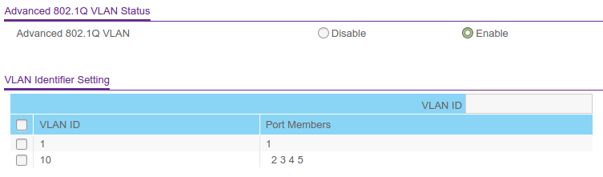
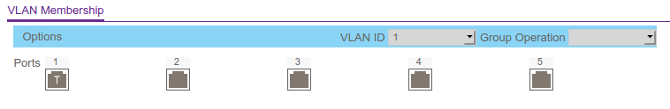
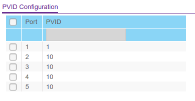

# Management VLAN for Netgear GS105E/GS108E

The Netgear firmware doesn't implement the functionality of a management VLAN on this devices. But there is a workaround which enables you to isolate the web configuration page from all port access.

It's quite simple. The web configuration page is accessible via the default VLAN (VID: 1) only. You just remove ports you don't want to have access by and configure the trustworthy ports as tagged.

### VLAN Configuration

### VLAN Membership

### VLAN Port PVID

With these settings the web configuration page will be only accessible via port 1 (tagged PVID=1).

### License

This project is released under the Creative Commons Attribution v 4.0 license.

Copyright (c) 2020 Yoshua Hitzel

### Legal

This project is in no way affiliated with, authorized, maintained, sponsored or endorsed by NETGEAR, Inc. or any of its affiliates or subsidiaries. This is independent and unofficial. Use at your own risk.
